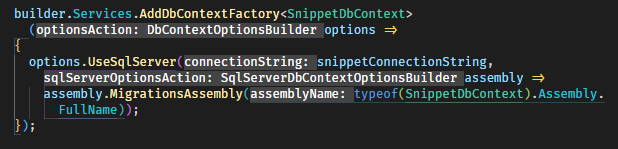
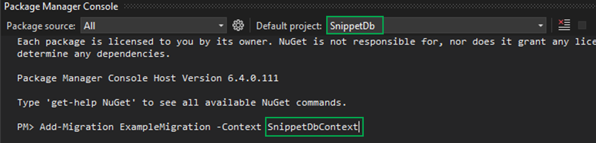
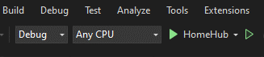

1. to get scoped CSS, you need to follow "*filename*.razor.css" file naming format.
2. Multiple projects in one solution, multiple DbContexts being injected.
      - EF Core can still manage multiple DbContexts using their automated tools.
      - Need to refer to the project assembly containing the Context you are adding to the DI Container
        
      - In Package Manager Console (Visual Studio), you have to change the default project at the top of the PMC to the project containing the context you are targeting with below tip.
      - When you have multiple Contexts in one solution, use -Context to target the desired context.
        
      - SnippetDb is not the startup project, HomeHub is.

        